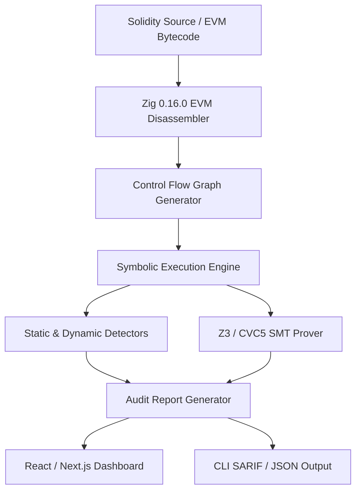

# Roche EVM Security Engine - System Architecture

## Core Subsystems

### 1. EVM Disassembler & Parser (Zig 0.16.0)
High-efficiency, zero-allocation opcode streaming disassembler mapping EVM byte stream to basic blocks.

### 2. Symbolic Execution Engine
Tracks symbolic registers, stack variables, and memory maps using fixed ring buffers for ultra-low latency branch exploration.

### 3. SMT Constraint Solver Interface
Translates path conditions directly into SMT-LIB2 format and queries Z3/CVC5 to prove invariants or identify counterexamples.

### 4. User Presentation Layer
TypeScript dashboard and CLI interfaces consuming standard SARIF/JSON outputs.
