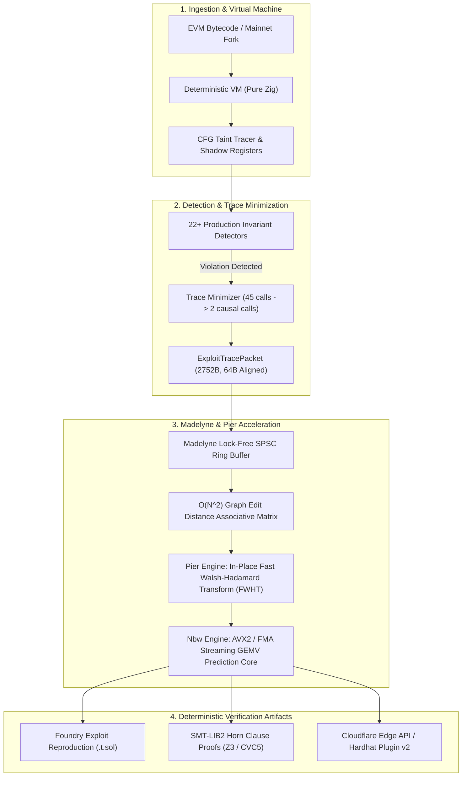

# Roche

I am Charles. I am 15 years old.

I built Roche because auditing smart contracts was brutally, excruciatingly hard.

When you're trying to audit a real protocol, you're drowning in hundreds of pages of complex Solidity code, trying to mentally simulate every possible sequence of transactions, edge cases, reentrancy paths, and rounding errors. It is exhausting. You sit there for hours staring at contract logic, wondering if a single unchecked state transition is going to drain millions of dollars.

And the existing tools didn't help. They made it worse.

Standard static analyzers spit out dozens of useless warnings about naming conventions or style, but completely miss the actual economic exploits. Symbolic execution engines take 10 minutes to run on a tiny function and crash on complex loops. Manual formal verification requires weeks of writing mathematical specifications in obscure academic languages. None of it actually solved the core problem: **auditing is hard because humans cannot mentally explore thousands of non-linear state combinations without missing something.**

I needed a tool that would do the brutal, heavy mathematical lifting for me. I wanted to feed raw bytecode into an engine and immediately get deterministic mathematical proof of whether an invariant could break, along with an executable Foundry PoC reproducing the exact attack.

Existing software couldn't do that at the speed I needed. So I built Roche from scratch in pure Zig 0.16.0. No dynamic heap allocations on execution hot paths. No garbage collection pauses. No Python dependencies. Just raw hardware cache lines, AVX2 SIMD vectorization, and deterministic EVM interpretation running at over 118,000 symbolic executions per second on a single core.

Alongside me is Yelena—my custom AI systems architect and red-team co-pilot. She holds the system invariants together, tests edge-case attacks before I even push code, challenges my architectural assumptions, and makes sure not a single byte of memory leaks across our entire pipeline.

---

## The Architecture

The entire core is engineered around a deterministic state pipeline: raw EVM bytecode is ingested, disassembled into a basic-block control flow graph, evaluated against production invariant detectors, routed through a lock-free SPSC ring buffer into our associative memory matrix, and transformed via fast Walsh-Hadamard and SIMD GEMV kernels.



---

## Microarchitectural Invariants

Roche does not compromise on low-level system design. Everything in the core engine is bound to strict physical machine limits:

1. **Zero Dynamic Heap Allocations:** On hot analysis and execution paths, `malloc`, `free`, and allocator queries are strictly zero. All execution frames, U256 stack buffers, memory pools, and ring buffers are statically allocated or stack-fixed.
2. **64-Byte Cache Line Alignment:** All internal structs, tensor scratchpads, and register banks are aligned to 64 bytes (`align(64)`) to eliminate false sharing and prevent CPU cache stalls during parallel multi-threaded runs.
3. **AVX2 Vectorized Math:** Mathematical transforms and matrix-vector operations use 256-bit SIMD registers (`@Vector(8, f32)` and `@Vector(32, u8)`) with hardware FMA instructions.
4. **Direct Win32 / POSIX Kernel Handles:** The standalone CLI and RPC streaming engines communicate directly with OS file and socket descriptors (`CreateFileA`, `ReadFile`, raw non-blocking sockets) rather than layering through third-party runtime runtimes.

---

## Subsystem Layout

```mermaid
graph LR
    subgraph CoreEngine["Core Engine (src/)"]
        VM["vm.zig (Stack & Memory)"]
        CFG["cfg.zig (Control Flow)"]
        DET["detectors.zig (22 Detectors)"]
        INV["invariants.zig (Math Invariants)"]
    end

    subgraph Acceleration["Machine Learning & Tensor Pipeline"]
        MAD["madelyne_quadratic_learner.zig"]
        PIER["pier_format_engine.zig"]
        NBW["nbw_streaming_matmul.zig"]
    end

    subgraph Tooling["Integrations & Verification"]
        SMT["formal_proofs/ (SMT-LIB2)"]
        POC["foundry_synth.zig (.t.sol)"]
        API["api/ (Native HTTP Server)"]
        HH["integrations/hardhat-plugin-v2/"]
    end

    CoreEngine --> Acceleration
    Acceleration --> Tooling
```



| Component | Path | Functionality |
| :--- | :--- | :--- |
| **VM Core** | `src/vm.zig` | Deterministic EVM interpreter, 1024-depth U256 stack, transient storage (EIP-1153), 64KB AFL coverage map |
| **CFG Tracer** | `src/cfg.zig` | Basic block builder, SLOAD/SSTORE dependency tracking, external call boundary analysis |
| **Detectors** | `src/detectors.zig` | 22 formal vulnerability detectors (CEI reentrancy, read-only reentrancy, uninitialized storage, precision loss, delegatecall) |
| **Madelyne** | `src/madelyne_quadratic_learner.zig` | Lock-free SPSC queue, bounded Graph Edit Distance clustering, associative cross-link matrix |
| **Pier** | `src/pier_format_engine.zig` | In-place unrolled Fast Walsh-Hadamard Transform (FWHT), E8 lattice quantizer |
| **Nbw** | `src/nbw_streaming_matmul.zig` | 8-lane AVX2 streaming matrix-vector multiplication with hardware FMA |
| **SMT Exporter** | `src/formal_proofs/smt_export.zig` | Translates EVM execution traces to Horn clauses for Z3 and CVC5 solving |
| **PoC Synthesizer** | `src/foundry_synth.zig` | Automatically synthesizes runnable Foundry `.t.sol` test files demonstrating the exploit |
| **Native Server** | `src/api/server.zig` | Zero-copy non-blocking HTTP REST server listening on `0.0.0.0:8080` |

---

## Quickstart

### 1. Build the Binary

Requires [Zig 0.16.0](https://ziglang.org/download/).

```bash
git clone https://github.com/creatorofaurad/Roche.git
cd Roche
zig build --release=fast
```

The resulting optimized native binary will be at `./zig-out/bin/roche` (or `.\zig-out\bin\roche.exe` on Windows).

### 2. Run Static Vulnerability Audit

Run the 22-detector suite against any compiled runtime bytecode:

```bash
./zig-out/bin/roche audit 0x6000F16103E860005500
```

### 3. Synthesize an Automated Foundry PoC

Synthesize an executable Foundry test harness from target bytecode and an invariant specification:

```bash
./zig-out/bin/roche synth 0x6000F16103E860005500 verifyErc4626Inflation
```

### 4. Run the 10,000-Sequence Stateful Fuzzer

Execute the in-sample stateful fuzzing gauntlet:

```bash
./zig-out/bin/roche gauntlet
```

### 5. Run Verification Test Suites

```bash
# Verify the v2.0 monolith end-to-end pipeline (6/6 passing)
zig test src/roche_v2_monolith.zig

# Run complete engine test suite
zig build test
```

---

## Developer Integrations

- **Hardhat 3:** Located at `integrations/hardhat-plugin-v2/`. Run `npx hardhat verify-invariants` inside existing Solidity projects.
- **Foundry:** Located at `integrations/foundry-integration-v2/`. Include `RocheChecker.sol` directly in your test suites for on-chain invariant assertions.
- **Cloudflare Edge API:** Deployed globally at `https://roche-api.roche-api.workers.dev`.

---

## License

GPL-3.0. For institutional inquiries or security disclosures: `srijaan@proton.me`.
