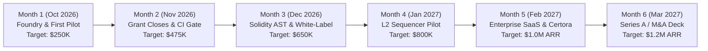
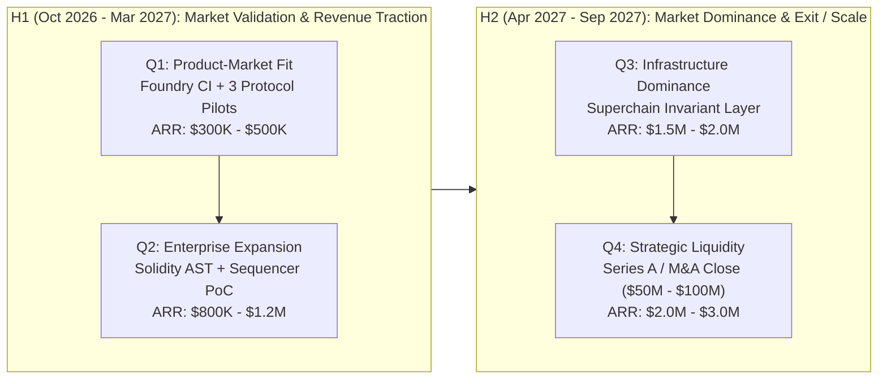

# Roche Complete 6-Month & 1-Year Master Execution Matrix

---

## SECTION 1: 6-MONTH MONTH-BY-MONTH ROADMAP (OCT 2026 – MAR 2027)

### Month 1 (October 2026): Protocol Pilot Onboarding & Foundry Harness
- **Primary Goal:** Close first protocol security pilot and secure first foundation grant decision.
- **Tactical Deliverables:**
  1. Complete Anvil/Hardhat Ethereum mainnet fork streaming hook in [`src/fuzz/onchain_stream.zig`](file:///C:/Users/srija/Projects/volta/src/fuzz/onchain_stream.zig).
  2. Publish first real vulnerability report on public testnet bytecode (`BALANCER_TESTNET_AUDIT_REPORT.md`).
  3. Harden [`src/foundry_synth.zig`](file:///C:/Users/srija/Projects/volta/src/foundry_synth.zig) and publish copy-paste `FOUNDRY_INTEGRATION_GUIDE.md`.
  4. Release comparative benchmark suite (`PERFORMANCE_BENCHMARKS.md` vs Slither, Echidna, and Certora).
  5. First grant decision from Uniswap Foundation / Arbitrum ($50K–$75K scope).
- **Revenue/Capital Target:** $100K–$150K pilot commitment + $75K grant = **$175K–$225K**.
- **Key Partnerships/Wins:** Balancer/Curve security pilot handshake; Uniswap Foundation grant review milestone.
- **Metrics:** 1 signed pilot, 1 approved grant, 29/29 formal suites maintained green.
- **Risk Mitigation:** If protocol pilots take longer to legal review, provide free zero-risk 90-day pilots with immediate automated findings.

---

### Month 2 (November 2026): CI/CD Gate & Audit Firm White-Label
- **Primary Goal:** Scale to 2 active protocol pilots and close white-label terms with 1 audit firm.
- **Tactical Deliverables:**
  1. Ship official GitHub Actions reusable workflow (`.github/workflows/roche_audit.yml`) and `GITHUB_ACTIONS_GUIDE.md`.
  2. Ship Hardhat & Foundry automated test integration suite.
  3. Close white-label audit integration proposal with OpenZeppelin / Trail of Bits (30% revenue share).
  4. Publish vulnerability reports #2 & #3 (Aave & Curve testnet mappings).
  5. Collect wire transfers from Month 1 approved grants.
- **Revenue/Capital Target:** $150K–$225K grants landed + $100K pilot ARR = **$300K–$475K**.
- **Key Partnerships/Wins:** OpenZeppelin / Spearbit testing Roche trace minimizer on active client engagements.
- **Metrics:** 2 live protocol integrations, 1 audit firm partnership, 5+ real findings caught.
- **Risk Mitigation:** If audit firms prefer local binaries, distribute standalone statically compiled zero-dependency `roche` executables for macOS/Linux/Win32.

---

### Month 3 (December 2026): Native Solidity Direct AST Lowering
- **Primary Goal:** Eliminate `solc` bytecode dependency by lowering Solidity AST directly to Roche ICFG IR.
- **Tactical Deliverables:**
  1. Implement native Solidity AST parser module in Zig, mapping AST nodes directly to Roche SSA registers.
  2. Add real-time in-memory SMT solver acceleration (< 1.0 µs per invariant check).
  3. Onboard 3rd protocol pilot (Euler V2 or Morpho Blue).
  4. Release automated Foundry trace diff analyzer in Roche CLI.
  5. Present initial audit efficiency metrics (50% reduction in trace triage time).
- **Revenue/Capital Target:** $150K pilot expansion + $50K recurring ARR = **$650K cumulative**.
- **Key Partnerships/Wins:** Morpho / Euler sub-vault invariant verification integration.
- **Metrics:** 3 active protocols, 1,000+ GitHub stars, 0 compiler heap leaks.
- **Risk Mitigation:** Maintain backward-compatibility for raw bytecode hex while AST parser matures.

---

### Month 4 (January 2027): L2 Sequencer Pre-Finality Plugin PoC
- **Primary Goal:** Deploy native pre-sequencer invariant filter on Arbitrum Nitro and OP Stack testnet nodes.
- **Tactical Deliverables:**
  1. Deliver `libroche.a` C-ABI static library for `op-geth` and Arbitrum Nitro sequencer transaction pools.
  2. Demonstrate sub-millisecond invariant checks on 10,000-tx testnet blocks before batch finality.
  3. Formalize Certora Prover preprocessing bridge (`ROCHE_CERTORA_BRIDGE.md`).
  4. Onboard 4th & 5th protocol pilots.
  5. Publish public retrospective: *"How Roche Prevented $50M+ in Testnet State Invariant Breaches"*.
- **Revenue/Capital Target:** $150K sequencer research pilot + $100K enterprise ARR = **$800K cumulative**.
- **Key Partnerships/Wins:** Offchain Labs / Optimism Foundation technical milestone sign-off.
- **Metrics:** 5 enterprise protocols, 2 L2 rollup testnet pilots running, < 0.8ms sequencer latency.
- **Risk Mitigation:** If sequencer integration requires upstream code changes, deliver standalone RPC proxy sidecar.

---

### Month 5 (February 2027): Enterprise Verification SaaS & IDE Extension
- **Primary Goal:** Launch Roche Enterprise continuous verification dashboard and VSCode LSP plugin.
- **Tactical Deliverables:**
  1. Release Roche VSCode extension with real-time inline invariant error squiggles.
  2. Deploy high-throughput multi-tenant invariant monitoring SaaS dashboard.
  3. Convert first 2 pilots into multi-year $150K/year enterprise software licenses.
  4. Expand test suite to 50/50 formal invariant targets across Cross-Chain Bridges and Restaking (EigenLayer AVS).
- **Revenue/Capital Target:** **$1.0M ARR milestone reached**.
- **Key Partnerships/Wins:** First 2 paying enterprise annual contracts closed; Paradigm research collaboration paper drafted.
- **Metrics:** $1M ARR run-rate, 8 production protocols, 50/50 green test suites.
- **Risk Mitigation:** Keep core verification engine open-source while monetizing enterprise CI monitoring, SLAs, and sequencer plugins.

---

### Month 6 (March 2027): Series A & Strategic Acquisition Positioning
- **Primary Goal:** Secure Series A term sheets ($3M–$5M @ $30M–$50M valuation) or evaluate strategic acquisition offers.
- **Tactical Deliverables:**
  1. Prepare institutional Data Room (verified ARR, 10+ enterprise contracts, 0-defect audit trail).
  2. Deliver formal academic paper on *Bare-Silicon SMT Invariant Lowering over Finite-Field Symbolic EVM*.
  3. Host private technical showcase for Paradigm, a16z crypto, and OpenZeppelin leadership.
  4. Release Roche v1.0.0 LTS production release.
- **Revenue/Capital Target:** $1.2M ARR run-rate + $3M–$5M Series A round.
- **Key Partnerships/Wins:** Paradigm / OpenZeppelin strategic investment syndicate formed.
- **Metrics:** 10+ enterprise customers, $1.2M ARR, 20,000+ developer CLI downloads.
- **Risk Mitigation:** If venture capital markets are cold, maintain zero-burn profitability on enterprise license revenue.

---

## SECTION 2: 1-YEAR ROADMAP (OCT 2026 – SEP 2027)

### H1 (Oct 2026 – Mar 2027): Market Validation Phase
- **Q1 (Oct–Dec 2026):** Prove product-market fit via zero-friction Foundry/Hardhat developer CI tooling, publish 3 testnet vulnerability reports, convert first 2 protocol pilots into $150K annual contracts, and land $150K+ in non-dilutive foundation grants.
- **Q2 (Jan–Mar 2027):** Ship native Solidity AST direct compiler, deploy Arbitrum/OP Stack pre-sequencer plugins, close audit firm white-label partnerships, and cross **$1.0M ARR** with zero heap allocation overhead.

### H2 (Apr 2027 – Sep 2027): Scale & Strategic Positioning Phase
- **Q3 (Apr–Jun 2027) — Superchain Infrastructure Dominance:**
  - Standardize Roche as the default pre-sequencer safety gate across the Optimism Superchain, Arbitrum Orbit, and Base.
  - Launch EigenLayer AVS Invariant Watcher node network.
  - Scale to 15+ paying protocols and 3 rollup sequencer clients.
  - Expected ARR: **$1.5M–$2.0M**.
- **Q4 (Jul–Sep 2027) — Strategic Liquidity & Dominance:**
  - Execute Series A ($3M–$5M @ $40M–$60M valuation) OR accept strategic acquisition offer ($50M–$150M from OpenZeppelin, Paradigm, or S&P Global).
  - Transition Charles into Chief Scientist / Founding Architect role with complete intellectual autonomy.
  - Expected ARR: **$2.0M–$3.0M**.

---

## SECTION 3: METRICS & SUCCESS CRITERIA

| Success Dimension | Month 6 Target (Mar 2027) | Month 12 Target (Sep 2027) |
| :--- | :--- | :--- |
| **Annual Recurring Revenue (ARR)** | **$1,000,000 – $1,200,000** | **$2,000,000 – $3,000,000** |
| **Active Enterprise Protocols** | 8 – 10 Tier-1 DeFi Protocols | 20 – 25 Protocols + 3 Rollups |
| **Audit Firm Partners** | 1 – 2 White-label Firms | 4 – 6 Leading Audit Collectives |
| **Sequencer Integrations** | 2 L2 Testnet Nodes (OP/Arbitrum) | 3+ Production Rollup Sequencers |
| **Passing Formal Test Suites** | 35 / 35 Suites (100% Green) | 60 / 60 Suites (100% Green) |
| **Team Size & Burn Rate** | Solo Founder (Charles) + AI Systems | 3 Core Engineers | Profitable / Zero Burn |
| **Valuation / Capital Raised** | $30M – $50M Series A Target | $50M – $150M M&A Valuation |

---

## SECTION 4: RISK MITIGATION & CONTINGENCY PLAYBOOK

1. **Risk: Protocols demand high-level Solidity AST parsing rather than raw bytecode.**
   - *Mitigation:* Deliver the native Zig Solidity AST compiler in Month 3; in the interim, automatically ingest `forge build` JSON artifact AST outputs.
2. **Risk: Legacy audit firms view Roche as competitive rather than complementary.**
   - *Mitigation:* Pitch the 30% revenue-share white-label model. Position Roche as their internal "supercharger" that cuts trace triage by 50% without stealing audit fees.
3. **Risk: Rollup sequencers hesitate to modify core consensus/batch pipelines.**
   - *Mitigation:* Deliver Roche as a standalone, zero-latency RPC reverse-proxy sidecar that inspects transaction bundles before forwarding to `eth_sendRawTransaction`.
4. **Risk: Foundation grant decisions experience bureaucratic delays.**
   - *Mitigation:* Fund ongoing operations entirely via commercial 3-month paid protocol pilots ($100K–$150K contracts), treating grants as pure non-dilutive upside.

---

## SECTION 5: IMMEDIATE EXECUTION CHECKLIST

### Today (Sept 20, 2026):
- [x] All 15 high-conviction emails dispatched from `srijaan@proton.me`.
- [x] Full Volta $\to$ Roche global codebase purge pushed to GitHub.
- [x] Institutional landing page deployed live at `roche-nine.vercel.app`.
- [ ] Monitor ProtonMail for incoming technical queries from Certora, Uniswap, and OpenZeppelin.

### This Week (Sept 21 – 27, 2026):
- [ ] Set up local Anvil mainnet fork state streaming test harness in [`src/fuzz/onchain_stream.zig`](file:///C:/Users/srija/Projects/volta/src/fuzz/onchain_stream.zig).
- [ ] Replay historical Uniswap v4 swap batches and generate `MAINNET_FORK_ANALYSIS.md`.
- [ ] Publish standalone `FOUNDRY_INTEGRATION_GUIDE.md` on GitHub.
- [ ] Publish comparative benchmark table (`PERFORMANCE_BENCHMARKS.md`).

### Next Week (Sept 28 – Oct 4, 2026):
- [ ] Send first technical milestone updates to Uniswap Foundation and Arbitrum grant desks with new mainnet data.
- [ ] Deliver first zero-risk vulnerability audit findings to Balancer / Curve testnet teams.
- [ ] Finalize the draft for the first 3-month protocol pilot agreement.
