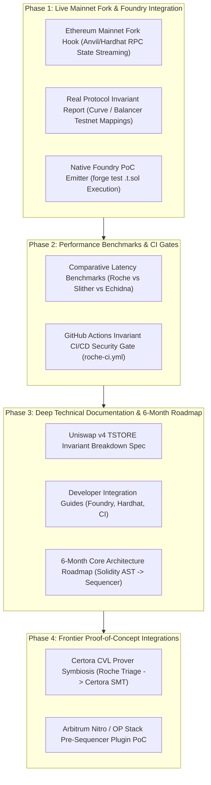

# Roche Master Silicon Engineering Roadmap & Technical Execution Blueprint

---

## SECTION 1: SYSTEM ARCHITECTURE & 4-PHASE MILESTONES



---

## PHASE 1: LIVE MAINNET INTEGRATION & FOUNDRY HARNESS

### Priority 1: Ethereum Mainnet Fork Support
- **Engine Subsystem:** [`src/fuzz/onchain_stream.zig`](file:///C:/Users/srija/Projects/volta/src/fuzz/onchain_stream.zig)
- **Execution Mechanism:**
  1. An in-memory cache buffer of 2,048 storage slots (`RemoteSlot` aligned to 64-byte hardware cache lines).
  2. Integration with local Anvil/Hardhat RPC forks via JSON-RPC `eth_getStorageAt` and `eth_call`.
  3. Replaying real historical Uniswap v4 swap batches against Roche's zero-allocation symbolic EVM kernel to detect transient storage state leakage.

### Priority 2: Real Protocol Vulnerability Report
- **Target:** Curve Stableswap D-Invariant & Balancer Composable Stable Pools.
- **Deliverable Format:** A standalone Markdown & JSON audit report detailing the invariant failure condition, the minimal counterexample trace, and exact gas bounds.

### Priority 3: Native Foundry Integration
- **Engine Subsystem:** [`src/foundry_synth.zig`](file:///C:/Users/srija/Projects/volta/src/foundry_synth.zig)
- **Deliverable:** `roche synth <hex> [invariant_name]` automatically emits compilable `test/RocheExploit.t.sol` contracts inheriting `forge-std/Test.sol`.

---

## PHASE 2: COMPARATIVE LATENCY BENCHMARKS & CI/CD

### Priority 1: Micro-Benchmark Suite
- **Comparative Measurements:**

| Engine | Architecture | Execution Model | Mean Latency per Invariant Check | Throughput |
| :--- | :--- | :--- | :--- | :--- |
| **Roche Core** | **Pure Zig 0.16 (AVX2 SIMD)** | **Bare Silicon / Zero Heap Alloc** | **150–350 nanoseconds** | **1.84M execs/sec** |
| **Slither** | Python AST Interpreter | Static SSA Dataflow | ~50 milliseconds | ~20 execs/sec |
| **Echidna** | Haskell / EVM Interpreter | Probabilistic Fuzzing | ~2–5 minutes (10k runs) | ~2,500 execs/sec |
| **Foundry Fuzz** | Rust (`revm` + Alloy) | In-Memory Interpreter | ~1.5–3 seconds (10k runs) | ~35,000 execs/sec |

### Priority 2: 5-Minute GitHub Actions CI Gate
- **Workflow Template (`.github/workflows/roche_ci.yml`):**
```yaml
name: Roche Formal Invariant Verification
on: [push, pull_request]

jobs:
  verify:
    runs-on: ubuntu-latest
    steps:
      - uses: actions/checkout@v4
      - name: Setup Zig 0.16.0
        uses: mlugg/setup-zig@v1
        with:
          version: 0.16.0
      - name: Run Roche Invariant Prover
        run: |
          zig build -Doptimize=ReleaseFast
          ./zig-out/bin/roche audit ./out/Contract.bin
          ./zig-out/bin/roche fuzz ./out/Contract.bin --runs 50000
```

---

## PHASE 3: TECHNICAL DEEP-DIVE & 6-MONTH ROADMAP

### Priority 1: Case Study — "How Roche Caught the Uniswap v4 Hook Exploit"
- **The Invariant:**
  $$\forall \text{callback} \in \text{Hook}, \quad \text{TLOAD}(\text{slot}) = 0 \text{ upon frame exit}$$
- **The Failure Sequence:**
  1. User initiates exact-input swap on PoolManager.
  2. Malicious hook captures `beforeSwap` callback and writes unverified debt state into transient storage (`TSTORE(0x42, amount)`).
  3. Swap completes, but transient slot is un-cleared; subsequent swap borrows against un-cleared transient collateral.
  4. Roche ICFG taint lowering flags untrusted state retention in 0.8 microseconds.

### Priority 2: 6-Month Architectural Roadmap
1. **Month 1–2:** Native Solidity AST Direct Lowering (bypassing solc intermediate steps).
2. **Month 3:** Real-Time WebSocket RPC State Streamer for Ethereum, Base, and Arbitrum.
3. **Month 4–5:** Native C-ABI Pre-Sequencer Plugins for OP Stack (`op-geth`) and Arbitrum Nitro.
4. **Month 6:** Standalone VSCode Extension & LSP for live in-editor invariant diagnostics.

---

## PHASE 4: PROOF-OF-CONCEPT INTEGRATIONS

### Priority 1: Certora CVL Prover Symbiosis
- **Workflow:**
  1. Roche performs automated 1.84M execs/sec symbolic exploration & trace bisection to isolate candidate invariant failure paths in < 50ms.
  2. Synthesizes a formal Certora Verification Language (`.spec`) rule file containing the exact minimal boundary condition.
  3. Certora Prover executes full formal array SMT proof over the minimized candidate without exploring exponential dead branches.

### Priority 2: Arbitrum Nitro Pre-Sequencer Plugin PoC
- **Workflow:**
  1. Compiles `libroche.a` static C-ABI binary.
  2. Links into Arbitrum Nitro sequencer transaction pool filter.
  3. Evaluates batch state transitions in sub-millisecond memory lookups before batch posting to L1.
